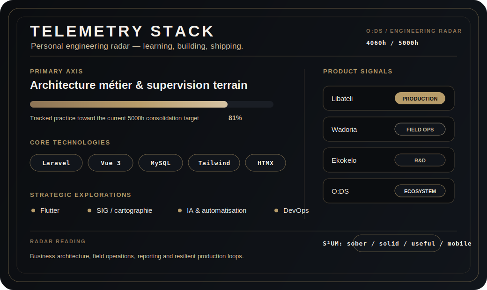

# Olivier Otschudi Omanga

<p align="center">
  
  
  
</p>

<h3 align="center">Développeur web · Architecte logiciel · Entrepreneur optimiste</h3>

<p align="center">
  Consultant senior full stack, fondateur de la marque professionnelle <strong>O:DS</strong>,
  je construis des outils métier pour transformer les contraintes du terrain en systèmes fiables.
</p>

<p align="center">
  Je conçois des systèmes numériques sobres, solides et utilisables en conditions réelles :
  opérations terrain, données sensibles, supervision multi-sites, reporting et mise en production progressive.
</p>

---

## O:DS en une phrase

Mon travail part rarement d'un écran vide. Il part du terrain : des équipes, des rapports, des rôles, des validations, des accès, des incidents et des décisions qui doivent circuler proprement.

Je transforme ces contraintes en logiciels métier : architecture, base de données, backend, interface, déploiement, documentation et amélioration continue.

> **S²UM : Sobre. Solide. Utile. Mobile.**  
> Moins de bruit, plus de structure. Moins de promesses, plus de production.

---

## Ce que je construis

| Domaine | Ce que je livre | Exemples concrets |
|---|---|---|
| Architecture SI | workflows, rôles, responsabilités, données, règles d'accès | cadrage métier, cartographie, modularisation |
| Full stack métier | backend, frontend, API, tableaux de bord, interfaces de gestion | Laravel, PHP, Node.js, Vue 3, HTMX, Alpine |
| Données & reporting | modèles relationnels, consolidation, qualité, traçabilité | MySQL, PostgreSQL, Firebase, tableaux de bord |
| Production & DevOps | CI/CD, VPS, documentation, support, itérations | GitHub Actions, Linux, suivi post-déploiement |
| Transformation terrain | passage d'un processus opérationnel à un outil exploitable | sécurité privée, supervision, rondes, incidents |

---

## Produits et systèmes

### Libateli

ERP métier pour entreprises de sécurité privée, en production chez **3 clients payants**.

`Laravel` · `Vue 3` · `MySQL` · `Tailwind` · `rôles` · `reporting` · `traçabilité`

Gestion des clients, sites, agents, contrats, affectations, événements, rapports, véhicules, K9, planning, facturation et tableaux de bord.

### Wadoria

Supervision terrain et contrôle de ronde, déployée à **l'École Française de Lubumbashi**.

`Node.js` · `Express` · `Firebase` · `MySQL` · `API` · `supervision temps réel`

Suivi des rondes, passages, incidents, points de contrôle, preuves d'activité et reporting opérationnel.

### Ekokelo

Plateforme de coordination institutionnelle autour des incidents et interventions.

`Laravel` · `cartographie` · `workflows` · `accès différenciés` · `données sensibles`

### SINA

Annuaire et organigramme institutionnel.

`modélisation hiérarchique` · `recherche` · `interface interne` · `référentiels`

### B4Purpose

Contribution à un MVP ESG orienté reporting et suivi de projets.

`cadrage MVP` · `priorisation` · `livraison progressive` · `validation métier`

---

## Observatoire technique

Depuis **2021**, je comptabilise mes heures de pratique technique comme un outil de suivi quotidien : mesurer mon effort, comparer les langages et garder une vision claire de ma progression.

Ce journal ne reprend pas toutes les heures passées pendant mes études, ni les heures de consultance client, ni tout ce qui a été appris avant 2021. Il représente surtout les heures où je suis devant un ordinateur à coder, tester, lire, structurer, expérimenter et renforcer mes compétences.

Et non : tout ne finit pas forcément sur GitHub. Certains apprentissages servent à comprendre, d'autres à livrer, d'autres encore à mieux concevoir les prochains systèmes.

**Journal personnel de formation et pratique technique : 4 060 heures suivies.**  
Objectif actuel : **5 000 heures**. Reste à consolider : **940 heures**.

### TÉLÉMÉTRIE SYSTÈME — O:DS

Radar personnel d'ingénierie — apprendre, construire, livrer.

<p align="center">
  
</p>

<!-- TELEMETRY:BEGIN -->
<!-- Généré depuis le programme2026.xlsm avec scripts/update-telemetry-from-excel.py. -->
<p align="center">
  
  
  
</p>

```txt
[SOCLE PRINCIPAL]
Laravel                         ████████████████   905.5h   100%
Vue JS                          ████████           452.5h    50%
JavaScript                      █████                264h    29%
Node & Express JS               ███                  192h    21%
FrontEnd et Design              ███                  158h    17%
PHP                             ███                  153h    17%
Généralités + livres techniques ███                143.5h    16%
Python                          ██                   133h    15%
DevOps, GitHub Actions, CI/CD   ██                   130h    14%
Database - SQL                  ██                   115h    13%

[INTERFACE, PRODUIT & RECHERCHE]
Code review + tests + temps IA  ██                   112h    12%
Intelligence artificielle       ██                   103h    11%
WordPress                       ██                   101h    11%
React JS                        ██                    96h    11%
Math et algorithmique           ██                  90.5h    10%
GitHub + GitLab + VS Code + Vim ██                    87h    10%
Finance et management           ██                  85.5h     9%
Magazine + encyclopédie         ▌                     79h     9%
Astro                           ▌                     74h     8%
HTMX et Alpine                  ▌                     69h     8%
Firebase                        ▌                     61h     7%
Java                            ▌                     59h     7%
Excel, Access, MS Office        ▌                     57h     6%
Réseaux                         ▌                     57h     6%

[EXPLORATIONS & FONDATIONS]
OS                              ▌                     48h     5%
Web 3.0                         ▌                     42h     5%
Sécurité                        ▌                   41.5h     5%
TypeScript                      ▌                     37h     4%
Android                         ▌                     34h     4%
Architecture                    ▏                     18h     2%
Hardware                        ▏                     18h     2%
Physique et électronique        ▏                     16h     2%
Regex                           ▏                     15h     2%
Rust                            ▏                      7h     1%
C++                             ▏                      5h     1%
Go                              ▏                      1h     0%

[SYSTÈMES TERRAIN]
LIBATELI                         ● PRODUCTION
WADORIA                          ● DEPLOYMENT
EKOKELO                          ● R&D
O:DS                             ● ECOSYSTEM
```
<!-- TELEMETRY:END -->

---

## Stack de prédilection

<p align="center">
  
  
  
  
  
  
  
  
  
  
  
  
</p>

```txt
Frontend     Vue 3 · HTMX · Alpine · React · Astro · Tailwind
Backend      Laravel · PHP · Node.js · Express · API REST
Données      MySQL · PostgreSQL · SQLite · Firebase
Production   Git · GitHub Actions · CI/CD · Linux · VPS
Architecture workflows · rôles · permissions · audit trail · reporting
```

---

## Expérience terrain qui nourrit le code

Avant de construire des systèmes numériques, j'ai dirigé des opérations à grande échelle :

| Organisation | Rôle | Périmètre |
|---|---|---|
| Delta Protection | Directeur des Opérations Grand Katanga | 800+ agents, 100+ sites, 50+ clients |
| GSA | Directeur Provincial / Régional Est | 900+ agents, 6 grandes villes |
| ISS | Coordonnateur Technique, Sécurité Électronique | audits, chantiers, maintenance, équipe technique |

Cette expérience est devenue mon avantage d'architecte : je ne conçois pas seulement des modules, je conçois des systèmes qui respectent les contraintes humaines, opérationnelles et institutionnelles.

---

## Principes d'ingénierie

| Principe | Application |
|---|---|
| Comprendre avant de coder | analyser le terrain, les responsabilités et les points de friction |
| Structurer les données | rendre les informations fiables, traçables et exploitables |
| Modulariser | séparer les responsabilités et préparer la maintenance |
| Sécuriser | rôles, permissions, sessions, CSRF, accès aux données sensibles |
| Livrer progressivement | valider avec les métiers, réduire le risque, améliorer en production |
| Documenter | transmettre, clarifier, stabiliser |

---

## Contact

| Canal | Lien |
|---|---|
| LinkedIn | [linkedin.com/in/otscheck](https://linkedin.com/in/otscheck) |
| Site | [otscheck.com](https://otscheck.com) |
| Email | [olivier@libateli.com](olivier@libateli.com) |

<p align="center">
  <strong>O:DS</strong><br>
  sobriété premium · architecture calme · logiciels de terrain
</p>
